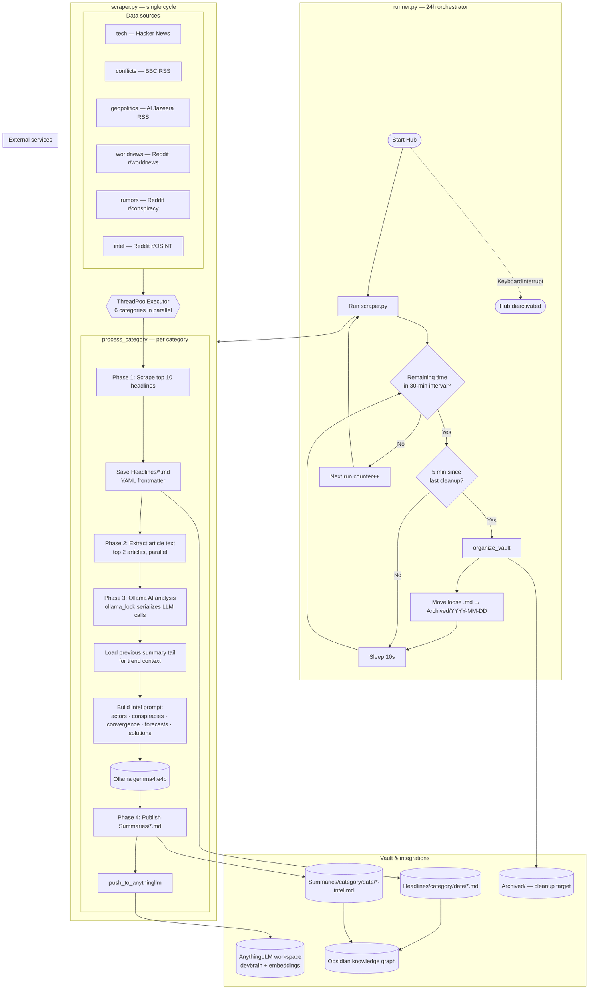

# DeVault Intelligence Hub

DeVault is an automated news scraping and AI-driven intelligence analysis pipeline. It is designed to collect headlines from various sources, extract deep context from key articles, and generate structured intelligence reports for use in Obsidian or other markdown-based knowledge management systems. All of this is done for absoulety free, using local compute power.

## 🚀 Features

- **Multi-Source Scraping**: Fetches headlines from RSS feeds (BBC, Al Jazeera), Reddit (worldnews, conspiracy, OSINT), and Hacker News.
- **Deep Context Extraction**: Automatically scrapes the full text of top articles to provide richer context for AI analysis.
- **Local AI Analysis**: Uses [Ollama](https://ollama.com/) (Gemma model) to analyze intel for political actors, conspiracies, convergence, forecasts, and potential solutions.
- **Obsidian Integration**: Generates markdown files with YAML frontmatter, organized by category and date.
- **AnythingLLM Integration**: Pushes generated reports to AnythingLLM for document management and vector embedding updates.
- **Automated Maintenance**: Includes a runner script that schedules scrapes every 30 minutes and performs vault cleanup every 5 minutes.

## 🔄 Pipeline Workflow

End-to-end flow from orchestration through scraping, AI analysis, vault storage, and external publishing.



| Stage | Component | Interval / behavior |
|-------|-----------|---------------------|
| Orchestration | `runner.py` | 30-min scrape cycles for 24h; 5-min vault cleanup during idle |
| Scrape | `scraper.py` Phase 1 | 6 categories in parallel; 10 headlines each |
| Context | Phase 2 | Top 2 articles per category; full-page text (300 char cap) |
| Analysis | Phase 3 | Ollama via serialized lock; prior summary injected as trend |
| Publish | Phase 4 | Markdown reports → vault + AnythingLLM upload + embedding refresh |

## 🕸️ Knowledge Graph

DeVault is optimized for Obsidian, allowing you to visualize the connections between different intelligence reports and news items. Below is a representation of the vault's knowledge graph, showing the high density of information collected over time.


## 📁 Project Structure

- `scraper.py`: The core engine responsible for scraping, context extraction, AI analysis, and publishing.
- `runner.py`: The orchestrator that schedules the scraper and manages vault organization.
- `Headlines/`: Contains individual news items saved as markdown files, categorized by topic.
- `Summaries/`: Contains AI-generated intelligence reports.
- `master_archive.jsonl`: A long-term record of all scraped items (legacy/archive).

## 🛠️ Setup & Configuration

### Prerequisites

1.  **Python 3.x**: Required to run the scripts.
2.  **Ollama**: Must be running locally with the `gemma4:e4b` model (or update `MODEL` in `scraper.py`).
3.  **AnythingLLM**: Must be running with an active API key and workspace.

### Configuration

Edit the configuration section in `scraper.py`:

```python
ANYTHINGLLM_URL = "http://127.0.0.1:3001/api/v1/document/upload"
ANYTHINGLLM_KEY = "YOUR_API_KEY"
WORKSPACE_SLUG = "devbrain"
BASE_PATH = os.path.expanduser("~/Documents/DeVault")
OLLAMA_URL = "http://127.0.0.1:11434/api/generate"
MODEL = "gemma4:e4b"
```

## 🏃 Usage

To start the intelligence hub, run the orchestrator:

```bash
python3 runner.py
```

This will activate the 30-minute scraping cycle and the 5-minute cleanup logic.

---


## 🔍 Code Review Findings

### 🛡️ Security
- **Hardcoded API Keys**: The `ANYTHINGLLM_KEY` is currently hardcoded in `scraper.py`. It is highly recommended to move this to an environment variable or a `.env` file.

### ⚙️ Reliability & Robustness
- **Broad Exception Handling**: The codebase uses many `try...except: pass` blocks. While this prevents the script from crashing, it hides potential issues (e.g., network failures, API changes).
- **AI Output Validation**: Several reports in the vault contain "No summary.", indicating silent failures in the Ollama pipeline. Better logging and retry logic for AI calls would improve reliability.
- **Context Limit**: The `extract_article_text` function currently only captures the first 300 characters of an article. This often includes navigation menus rather than core content. Increasing this limit or using a more sophisticated text extractor would improve AI analysis quality.

### 🏗️ Architecture & Performance
- **Concurrency**: Excellent use of `ThreadPoolExecutor` for parallel scraping and context extraction.
- **Resource Management**: The `ollama_lock` effectively prevents overloading the local LLM server by serializing AI requests.
- **Portability**: `runner.py` contains a hardcoded absolute path to `scraper.py`. This should be changed to a relative path to allow the project to run from any directory.

### 🧹 Maintenance
- **Vault Cleanup**: The `organize_vault` function in `runner.py` moves files to an `Archived` folder. However, `scraper.py` already organizes files into date-specific subfolders. This redundancy should be reviewed to ensure a clean directory structure.
